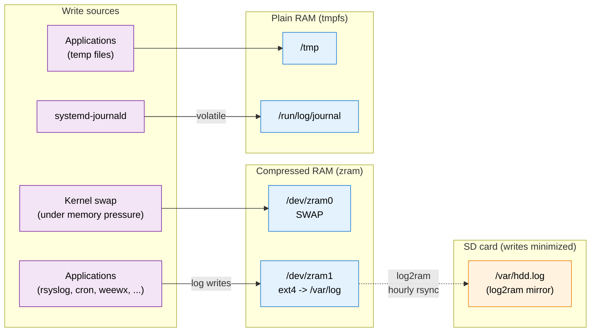
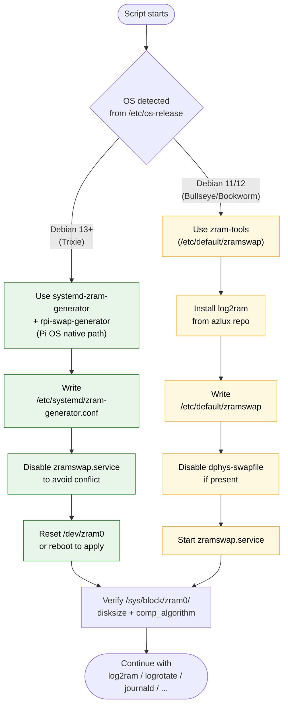
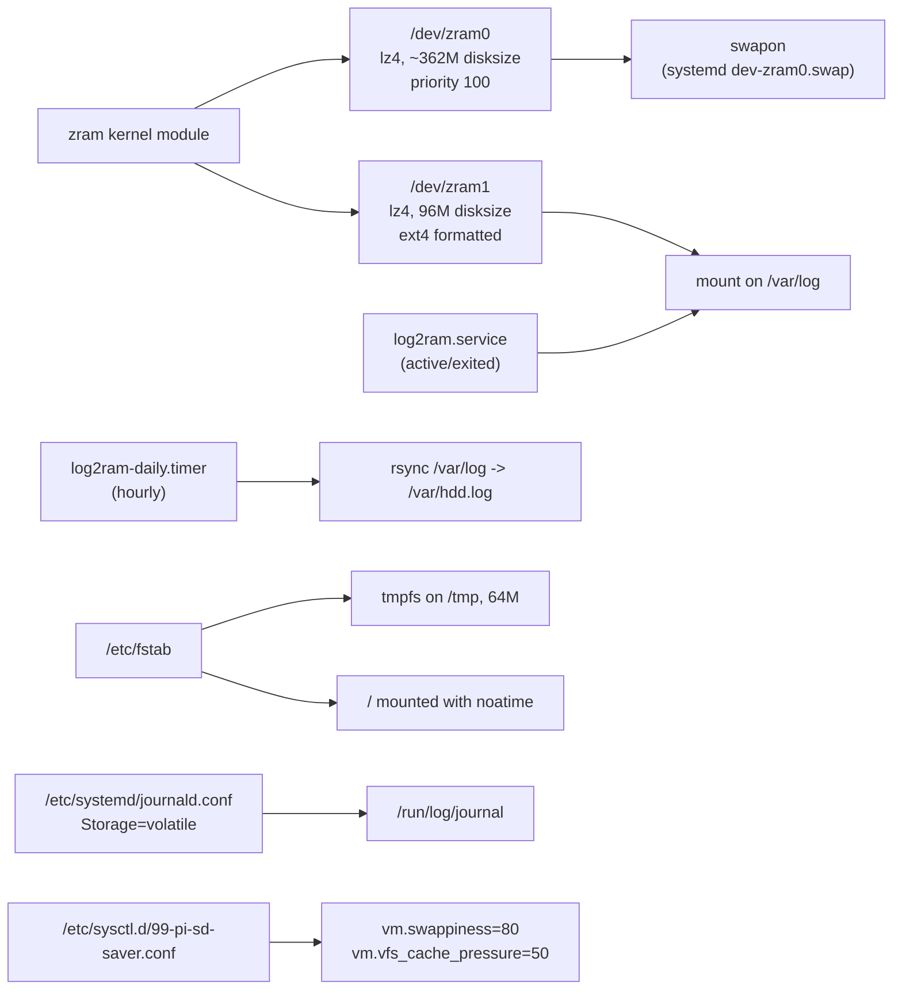

# ramdisk-logging

Reduce SD card wear on a Raspberry Pi by moving swap, `/var/log`, `/tmp`, and
the systemd journal into compressed RAM, with automatic periodic sync of logs
back to the SD card.

Tested on Raspberry Pi OS Trixie Lite (Pi 3). Supports Bullseye, Bookworm, and
Trixie automatically, and auto-tunes based on Pi model and RAM.

## What it does

| Component | Where it lives now | SD writes eliminated |
|---|---|---|
| Swap | zram block device (compressed RAM) | All swap writes |
| `/var/log` | zram block device (via log2ram) | All log writes except hourly rsync |
| `/tmp` | tmpfs (plain RAM) | All temp file writes |
| systemd journal | `/run/log/journal` (tmpfs) | All journal writes |
| Root filesystem | `noatime` mount option | Access-time metadata writes |
| Rotated logs | xz-compressed, hourly rotation | Bounded log growth in RAM |

Net effect: the SD card gets written to only during the hourly log2ram sync,
the daily apt update, and normal application data writes. Swap, logs, temp
files, and filesystem metadata stop hitting the SD card entirely.

## Per-Pi model configuration

The script auto-detects your hardware and OS and picks sensible defaults.
Detection reads `/proc/device-tree/model` for the Pi model, `/proc/meminfo`
for total RAM, and `/etc/os-release` for the OS codename. You can override any
of the resulting values after the fact by editing the config files listed in
the [Tuning](#tuning) section.

### Sizing by RAM tier

| RAM detected | Typical models | Compression | Swap (% of RAM) | `/var/log` tmpfs (zram) | `/tmp` tmpfs |
|---|---|---|---|---|---|
| ≥ 3.5 GB | Pi 4 (4GB / 8GB), Pi 5, CM4 (4GB / 8GB) | `zstd` | 50 % | 256M (zram 512M) | 200M |
| 1.8–3.5 GB | Pi 4 (2GB), CM4 (2GB) | `zstd` | 50 % | 128M (zram 256M) | 150M |
| < 1.8 GB | Pi 3 / 3A+ / 3B+, Zero 2 W, CM3, older | `lz4` | 40 % | 48M (zram 96M) | 64M |

### Compression algorithm by CPU class

The CPU drives the algorithm choice more than the RAM budget does — compression runs on every swapped page and every log write, so it has to be cheap:

| Pi model | CPU | Default algorithm | Why |
|---|---|---|---|
| Pi 5 | Cortex-A76 @ 2.4 GHz | `zstd` | Plenty of headroom; zstd's better ratio wins |
| Pi 4 / 400 / CM4 | Cortex-A72 @ 1.5–1.8 GHz | `zstd` | Same — enough CPU to afford zstd |
| Pi 3 / 3A+ / 3B+ / Zero 2 W / CM3 | Cortex-A53 @ 1.2–1.4 GHz | `lz4` | A53 is the bottleneck; lz4 gets ~90% of zstd's ratio at 2–3× the speed |
| Pi 2, Pi Zero W, original Pi / Zero | ARM11 / Cortex-A7 | `lz4` | Same reason, more so |

If you want the opposite trade-off (better ratio, slower CPU), override it per-device after install:

```bash
# Swap: edit /etc/systemd/zram-generator.conf (Trixie) or /etc/default/zramswap (older)
# /var/log: edit /etc/log2ram.conf -> COMP_ALG=
```

### OS-version differences

The script handles three Debian releases. Each has different package availability and a different "right way" to configure zram swap; the script picks the correct path for your release automatically.

| OS | Codename | Swap manager | log2ram source | dphys-swapfile |
|---|---|---|---|---|
| Debian 13 / Pi OS Trixie | trixie | `rpi-swap-generator` (reads `/etc/rpi/swap.conf`) with `systemd-zram-generator` for algorithm | main Debian repo | not shipped (no-op) |
| Debian 12 / Pi OS Bookworm | bookworm | `zram-tools` via `/etc/default/zramswap` | azlux third-party repo | disabled if present |
| Debian 11 / Pi OS Bullseye | bullseye | `zram-tools` via `/etc/default/zramswap` | azlux third-party repo | disabled if present |

Why the difference on Trixie: Raspberry Pi OS Trixie ships `systemd-zram-generator` pre-installed, plus a Pi-specific `rpi-swap-generator` that creates the actual `dev-zram0.swap` unit. Using `zram-tools` on Trixie causes the two generators to fight over `/dev/zram0`. The script detects this and disables `zramswap.service` to let the systemd-native path win. On older releases where the generator isn't installed, `zram-tools` is the simpler and correct choice.

### What's the same across all Pis

These settings are applied identically regardless of model or OS:

- `/tmp` mounted on tmpfs (plain uncompressed RAM, `noatime,nosuid`)
- systemd-journald set to `Storage=volatile` with 30M runtime / 50M system caps
- `/` mounted with `noatime`
- `vm.swappiness=80` and `vm.vfs_cache_pressure=50`
- logrotate rotates daily or at 5 MB, keeps 4 archives, xz-compressed
- logrotate moved from `/etc/cron.daily/` to `/etc/cron.hourly/`
- log2ram syncs to SD hourly via `log2ram-daily.timer` override

### What if the defaults don't fit my workload?

Common situations and quick adjustments:

- **Very chatty service on a small Pi** (e.g., `fail2ban`, verbose debug logging): bump `LOG_DISK_SIZE` in `/etc/log2ram.conf` to 256M and/or drop `rotate` to 2.
- **Want more log history on a Pi 4/5**: raise `rotate 4` → `rotate 30` in `/etc/logrotate.conf`; the larger RAM budget can absorb it.
- **Running Docker**: log2ram does *not* cover `/var/lib/docker/containers/*/…-json.log`. Configure Docker's log driver with `max-size` / `max-file` separately, or you'll still kill your SD card.
- **Battery / UPS-less Pi where crash-loss of logs matters**: shorten the sync interval via `sudo systemctl edit log2ram-daily.timer` (`OnCalendar=*:0/15` for 15 minutes).
- **Headless Pi Zero with < 512 MB free**: reduce `/tmp` size in `/etc/fstab` to 32M and log2ram `SIZE` to 32M.

## Requirements

- **OS**: Raspberry Pi OS Bullseye, Bookworm, or Trixie (or upstream Debian 11+)
- **Permissions**: root / sudo
- **Internet access**: needed to fetch packages on first run
- **Disk space**: a few MB for the packages it installs

All prerequisites beyond those are installed automatically:
`zram-tools`, `log2ram`, `rsync`, `xz-utils`, `systemd-zram-generator`
(Trixie), plus the azlux APT repo on Bullseye/Bookworm (log2ram is in the main
Debian repo on Trixie).

## Installation

Copy `ramdisk-logging.sh` to your Pi, then:

```bash
chmod +x ramdisk-logging.sh
sudo ./ramdisk-logging.sh
```

The script is **idempotent** — safe to re-run. Configs it already wrote are
rewritten to the same values; new ones are added where appropriate.

### What you should see

```
Detected OS: debian 13 (trixie)
Detected model: Raspberry Pi 3 Model B Rev 1.2
Detected RAM: 905 MB
Sizing -> swap 40% (lz4) | /var/log 48M (zram 96M lz4) | /tmp 64M
Tuning -> vm.swappiness=80, vm.vfs_cache_pressure=50
Swap manager: rpi-swap
==> Installing packages
==> Configuring zram swap (via rpi-swap)
==> Mounting /tmp on tmpfs
==> Configuring log2ram (ZL2R=true, lz4 compression)
==> Making log2ram sync hourly
==> Tuning logrotate
==> Tuning systemd-journald
==> Adding noatime to root mount
==> Writing sysctl tuning for zram
==> Setup complete.
```

### After the script finishes

On most systems everything activates immediately. On some Pis the live
reconfiguration of `/dev/zram0` doesn't take (the kernel holds the device with
its boot-time size). The script prints a clear warning when this happens:

```
WARNING: zram swap is 905M lz4, expected ~362M lz4.
Reboot once to clear stale state and the boot-time config will apply fresh.
```

If you see that, just reboot once. From then on every boot comes up with the
correct config.

```bash
sudo reboot
```

## Verification

After the script (and any required reboot), run these to confirm everything
is in place:

```bash
zramctl                              # two zram devices: swap + /var/log
swapon --show                        # /dev/zram0 at configured size
df -h /var/log /tmp                  # both RAM-backed
mount | grep -E '/(tmp|var/log)\s'   # tmpfs and zram mounts
systemctl status log2ram             # should be "active (exited)"
systemctl list-timers | grep log2ram # hourly sync timer armed
sysctl vm.swappiness vm.vfs_cache_pressure
free -h
```

Expected output on a Pi 3 with 1GB RAM:

```
$ zramctl
NAME       ALGORITHM DISKSIZE  ...  MOUNTPOINT
/dev/zram1 lz4            96M  ...  /var/log
/dev/zram0 lz4           362M  ...  [SWAP]

$ swapon --show
NAME       TYPE      SIZE USED PRIO
/dev/zram0 partition 362M   0B  100

$ sysctl vm.swappiness
vm.swappiness = 80
```

To confirm logs actually go to RAM (not the SD card):

```bash
# Generate a test log line
sudo logger "test from ramdisk-logging.sh"

# Check it's in zram's data counter
zramctl /dev/zram1

# And not on the SD mirror until the next sync:
stat /var/log/syslog /var/hdd.log/syslog
```

## Tuning

### Change how many days of log history to keep

Edit `/etc/logrotate.conf` and change `rotate 4` to whatever you like:

```bash
sudo sed -i 's/^rotate 4/rotate 30/' /etc/logrotate.conf
```

On a typical Pi 3 running weewx (~3–5 MB/day of logs), you can comfortably
keep **~90–120 days of compressed history** in the default 96M zram log disk.

### Use a different compression algorithm for logs vs swap

The two zram devices are independent. Defaults:

- Pi 4/5: `zstd` (better ratio, CPU can afford it)
- Pi 3 / Zero 2 W / older: `lz4` (faster on weaker cores)

To use a different algorithm for `/var/log` without touching swap:

```bash
# Example: use zstd for /var/log, leave swap on lz4
sudo sed -i 's|^COMP_ALG=.*|COMP_ALG=zstd|' /etc/log2ram.conf
sudo systemctl restart log2ram
```

### Change the hourly sync interval

```bash
sudo systemctl edit log2ram-daily.timer
# Change OnCalendar=hourly to whatever you prefer (e.g. "*:0/15" for 15 min)
```

More frequent sync = fewer logs lost in a crash, slightly more SD writes.

### Change the sysctl values

Edit `/etc/sysctl.d/99-pi-sd-saver.conf` and reload:

```bash
sudo sysctl --load=/etc/sysctl.d/99-pi-sd-saver.conf
```

## What gets configured (paths reference)

| File | Purpose |
|---|---|
| `/etc/rpi/swap.conf.d/99-pi-sd-saver.conf` | zram swap size + mechanism (Pi OS Trixie) |
| `/etc/systemd/zram-generator.conf` | zram swap compression algorithm |
| `/etc/default/zramswap` | zram swap config (Bullseye/Bookworm path) |
| `/etc/log2ram.conf` | log2ram: RAM disk size, compression, sync mode |
| `/etc/systemd/system/log2ram-daily.timer.d/override.conf` | hourly sync interval |
| `/etc/logrotate.conf` | rotation cadence, retention, xz compression |
| `/etc/cron.hourly/logrotate` | runs logrotate hourly (moved from daily) |
| `/etc/systemd/journald.conf` | volatile journal, size caps |
| `/etc/fstab` | /tmp tmpfs entry, noatime on root |
| `/etc/sysctl.d/99-pi-sd-saver.conf` | vm.swappiness, vm.vfs_cache_pressure |

## Troubleshooting

### "zram swap is 905M, expected ~362M" warning at end of script

Seen mostly on Pi OS Trixie with `rpi-swap`. The live device can't be
reconfigured once the kernel has initialized it with a particular disksize.
**Reboot once** — the boot-time generator will read the new config from
`/etc/rpi/swap.conf.d/99-pi-sd-saver.conf` on a fresh start.

### zramswap.service fails to start

Usually a conflict between `zram-tools` (`zramswap.service`) and Pi OS's
`rpi-swap-generator` or `systemd-zram-generator`. The script disables
`zramswap.service` on Trixie to prevent this. If it's still in a failed
state:

```bash
sudo systemctl disable --now zramswap.service
sudo systemctl reset-failed zramswap.service
```

### `/var/log` is filling up

Watch for this — when it hits 100%, new log writes fail and things break in
subtle ways. Check:

```bash
df -h /var/log
du -sh /var/log/* | sort -h | tail -10
```

Fixes: reduce `rotate N` in logrotate, tighten `maxsize`, or bump
`LOG_DISK_SIZE` in `/etc/log2ram.conf`. Don't forget to run log2ram restart
after changing its config:

```bash
sudo systemctl restart log2ram
```

### Logs seem to vanish after reboot

They went through log2ram's sync-to-SD on clean shutdown. If you lost power
before the hourly sync, everything since the last sync is gone. This is
by design — the trade for RAM-backed logs.

### Check what the script actually applied

```bash
cat /etc/rpi/swap.conf.d/99-pi-sd-saver.conf    # zram swap config (Trixie)
cat /etc/systemd/zram-generator.conf            # zram algo
grep -v '^#' /etc/log2ram.conf | grep -v '^$'   # log2ram
grep -E 'daily|rotate|maxsize' /etc/logrotate.conf
grep -E 'Storage|Max' /etc/systemd/journald.conf
grep -E '/tmp|noatime' /etc/fstab
cat /etc/sysctl.d/99-pi-sd-saver.conf
```

## Reverting

All changes made by the script can be undone by restoring the `.bak` files
it creates on first run:

```bash
# Restore individual configs (only the ones you want to revert):
sudo mv /etc/default/zramswap.bak          /etc/default/zramswap         2>/dev/null
sudo mv /etc/systemd/zram-generator.conf.bak /etc/systemd/zram-generator.conf 2>/dev/null
sudo mv /etc/log2ram.conf.bak              /etc/log2ram.conf
sudo mv /etc/logrotate.conf.bak            /etc/logrotate.conf
sudo mv /etc/systemd/journald.conf.bak     /etc/systemd/journald.conf
sudo mv /etc/fstab.bak                     /etc/fstab

# Remove new files the script created:
sudo rm -f /etc/rpi/swap.conf.d/99-pi-sd-saver.conf
sudo rm -f /etc/sysctl.d/99-pi-sd-saver.conf
sudo rm -f /etc/systemd/system/log2ram-daily.timer.d/override.conf

# Move logrotate back to daily cron:
sudo mv /etc/cron.hourly/logrotate /etc/cron.daily/logrotate 2>/dev/null

# Optional: remove the packages
sudo apt purge log2ram zram-tools

# Reboot to apply everything
sudo reboot
```

## How it works (brief architecture)

### Data flow



### Swap-manager selection on different OS versions



### Runtime view on a Pi 3 (Trixie)



On Pi OS Trixie specifically, `rpi-swap-generator` (from the `rpi-swap`
package) is the systemd generator that creates the `dev-zram0.swap` unit.
It reads `/etc/rpi/swap.conf[.d/*.conf]` for size and mechanism, and defers
to `systemd-zram-setup@zram0.service` (which reads
`/etc/systemd/zram-generator.conf`) for compression algorithm. On older Pi
OS versions, `zram-tools` (via `/etc/default/zramswap`) handles both.
The script picks the right path automatically.

## Maintenance

- Run the script again any time you upgrade the OS (e.g. Bullseye →
  Bookworm → Trixie); the auto-detection will pick the right config path
  for the new version.
- Check `/var/log` usage weekly for the first month to make sure your
  actual log volume fits comfortably in the RAM budget.
- If your workload changes (new services, debug logging), revisit
  `LOG_DISK_SIZE` in `/etc/log2ram.conf` and `rotate N` in
  `/etc/logrotate.conf`.

## Files

- `ramdisk-logging.sh` — the installer script (idempotent)
- `README.md` — this file