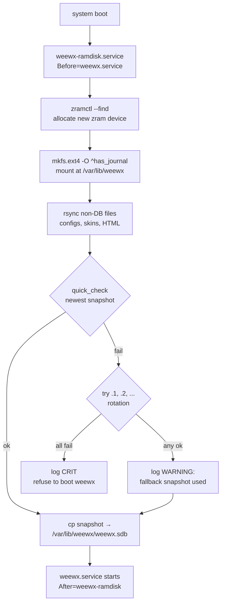
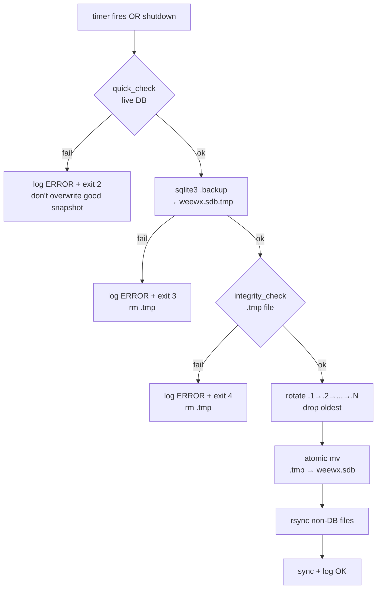

# WeeWX Database on zram — Setup Guide

Move WeeWX's SQLite database (`/var/lib/weewx/weewx.sdb`) off the SD card
and onto a **dedicated zram-backed ext4 filesystem**, with hourly validated
snapshots back to the SD card and a clean save on shutdown.

**Why**: WeeWX writes to the DB every archive period (every ~5 min) plus
`-wal` and `-shm` churn in between. Multiplied by years on a single SD card,
that's the #1 cause of Pi-based weather station data loss. This setup cuts
SD writes to hourly snapshots (and shutdown), dramatically extends SD life,
and also makes the DB *faster* because the live copy is in compressed RAM.

---

## What this gives you

| Component                         | Purpose                                         |
|-----------------------------------|-------------------------------------------------|
| `/var/lib/weewx` (zram, ext4)     | Live DB — where WeeWX reads and writes          |
| `/var/lib/weewx.hdd` (SD card)    | Persistent mirror — rotated snapshots live here |
| `weewx-ramdisk.service`           | Boot: allocate zram, restore validated snapshot |
|                                   | Shutdown: save + unmount + release zram         |
| `weewx-ramdisk-save.timer`        | Hourly snapshot of live DB → SD (with rotation) |
| `/etc/weewx-ramdisk.conf`         | Config read by all three helper scripts         |
| `weewx.service.d/ramdisk.conf`    | Drop-in that binds WeeWX lifecycle to the ramdisk |

Every snapshot goes through **validation** — `quick_check` the live DB, then
`sqlite3 .backup` to a `.tmp` file, then `integrity_check` the `.tmp` before
it's promoted to `weewx.sdb`. Corrupt writes are discarded; the previous
known-good snapshot stays on disk.

### Boot flow



### Periodic save flow (hourly timer + shutdown teardown)



### Idempotence

The installer `weewx-database-ramdisk.sh` is safe to re-run. It:

- Overwrites `/etc/weewx-ramdisk.conf` (backed up once as `.bak` on first run)
- Overwrites the three helper scripts in `/usr/local/sbin/`
- Overwrites the systemd unit files and the weewx drop-in
- `daemon-reload`s and re-enables the timer

If the zram is already mounted at `/var/lib/weewx` when you re-run, it skips
the initial `rsync /var/lib/weewx → .hdd` migration (the `.hdd` copy is
already the authoritative source). WeeWX is stopped if it was running and
restarted only if it was running beforehand. **No snapshots on SD are ever
deleted by re-running the installer.**

---

## Prerequisites

| Thing                            | Why                                                          |
|----------------------------------|--------------------------------------------------------------|
| Raspberry Pi OS Bullseye / Bookworm / Trixie | Tested targets                                   |
| `install-ramdisk.logging.sh` already run     | Installs/tunes `zramctl` and `zram-tools`        |
| WeeWX already installed          | `/var/lib/weewx/weewx.sdb` must exist (or this is fresh start) |
| ≥ 512 MB free RAM                | Actual zram usage is ~35–40% of the ext4 size on a SQLite workload |

**Run order** (first-time install):

1. `sudo bash install-ramdisk.logging.sh`  *(zram swap + log2ram)*
2. `sudo bash weewx-database-ramdisk.sh`   *(this script)*
3. `sudo bash weewx-onedrive-backup.sh`    *(optional off-site backup timers)*

---

## How to run

```bash
sudo bash weewx-database-ramdisk.sh
```

The script prints its detected plan before making changes:

```
Detected:
  OS:         trixie (13)
  Model:      Raspberry Pi 3 Model B Plus Rev 1.3
  DB size:    259 MB (/var/lib/weewx/weewx.sdb)
Plan:
  zram:       512M lz4  (estimated actual RAM: ~204 MB)
  snapshots:  hourly (SQLite online backup) + clean shutdown
  rotation:   keep last 5 snapshots (.sdb, .sdb.1 ... .sdb.5)
  validation: quick_check live DB before save; integrity_check on backups
```

It will briefly stop WeeWX (if running), mirror the DB to
`/var/lib/weewx.hdd`, install the unit files, start `weewx-ramdisk.service`
(which allocates zram and restores the snapshot), then restart WeeWX.

Expected total downtime for WeeWX: **under 30 seconds** on a Pi 3 with a
~260 MB DB.

---

## What it does (detail)

1. **Installs prerequisites** — `sqlite3`, `rsync`, `util-linux`
2. **Detects OS + Pi model** — reads `/etc/os-release` and
   `/proc/device-tree/model`; picks `zstd` on Pi 4/5/CM4/400, `lz4` on
   everything else (matches the logic in `install-ramdisk.logging.sh`)
3. **Sizes the zram** — ext4 size = `DB * 1.5`, rounded up to 128 MB,
   floor 256 MB. Actual RAM is ~40% of that with lz4, ~29% with zstd
4. **Copies `/var/lib/weewx` → `/var/lib/weewx.hdd`** — only on first run;
   subsequent runs detect the zram mount and skip migration
5. **Writes `/etc/weewx-ramdisk.conf`** — shared config for setup/save/teardown
6. **Installs helper scripts** in `/usr/local/sbin/`:
   - `weewx-ram-setup`   — boot: allocate + format + mount + restore
   - `weewx-ram-save`    — periodic + shutdown: validate + backup + rotate
   - `weewx-ram-teardown`— shutdown: save + umount + release zram
7. **Installs systemd units**:
   - `weewx-ramdisk.service` (oneshot, `RemainAfterExit=yes`,
     `ExecStart=weewx-ram-setup`, `ExecStop=weewx-ram-teardown`,
     `TimeoutStopSec=300`)
   - `weewx-ramdisk-save.service` (oneshot, `ExecStart=weewx-ram-save`)
   - `weewx-ramdisk-save.timer` (`OnBootSec=10min`, `OnUnitActiveSec=1h`,
     `Persistent=true`)
   - Drop-in `weewx.service.d/ramdisk.conf` — `Requires=` + `After=` to chain
     WeeWX's startup/shutdown to the ramdisk
8. **Enables everything** and starts `weewx-ramdisk.service`, then restarts
   WeeWX if it was active before

---

## What you can customize

Most knobs live in `/etc/weewx-ramdisk.conf` — change and restart the
services (no need to re-run the installer unless you're changing the
installer's own logic):

| Variable         | Default               | Notes                                         |
|------------------|-----------------------|-----------------------------------------------|
| `ZRAM_SIZE`      | `DB_MB × 1.5` (≥256M) | Ext4 size on the zram device. Bump if `df -h /var/lib/weewx` is creeping full |
| `ZRAM_ALGO`      | `zstd` (Pi 4/5) / `lz4` (Pi 3-) | Compression algorithm for the zram block device |
| `MOUNT`          | `/var/lib/weewx`      | Where WeeWX expects its DB — don't change without also patching WeeWX config |
| `PERSIST`        | `/var/lib/weewx.hdd`  | SD-card mirror path                           |
| `OWNER`          | `weewx:weewx`         | chown target for the restored DB              |
| `ROTATION_COUNT` | `5`                   | Number of rotated snapshots to keep on SD (`.sdb.1` ... `.sdb.N`). Each slot ≈ 1× DB size |

After editing:

```bash
sudo systemctl restart weewx-ramdisk.service
# Note: this STOPS weewx too (drop-in binds their lifecycle), then start weewx:
sudo systemctl start weewx
```

To change the **timer cadence** (e.g. snapshot every 30 min instead of
hourly), edit the timer unit directly:

```bash
sudo systemctl edit weewx-ramdisk-save.timer
# add under [Timer]:
# OnUnitActiveSec=30min
sudo systemctl daemon-reload
sudo systemctl restart weewx-ramdisk-save.timer
```

---

## Differences by Raspberry Pi model

The installer auto-picks sensible defaults, but here's what actually changes:

| Pi model        | `ZRAM_ALGO` | Why                                                | Est. RAM for 512M zram |
|-----------------|-------------|----------------------------------------------------|------------------------|
| Pi 5            | zstd        | Quad-core + plenty of headroom; zstd is 2× denser  | ~146 MB                |
| Pi 4 / CM4 / 400| zstd        | Same reasoning, plenty of CPU                      | ~146 MB                |
| Pi 3 / 3+       | lz4         | Still 4 cores but older; lz4 is gentler on latency | ~204 MB                |
| Pi Zero 2 W     | lz4         | Quad-core but thermally limited                    | ~204 MB                |
| Pi 2            | lz4         | Older cores — lz4 keeps save/restore quick         | ~204 MB                |
| Pi Zero (v1)    | lz4         | Single-core; zstd would stall during heavy writes  | ~204 MB                |

You can **force zstd on a Pi 3** (smaller RAM footprint, at the cost of a
little CPU during heavy writes) by editing `/etc/weewx-ramdisk.conf`:

```bash
sudo sed -i 's/^ZRAM_ALGO=.*/ZRAM_ALGO=zstd/' /etc/weewx-ramdisk.conf
sudo systemctl restart weewx-ramdisk.service
sudo systemctl start weewx
```

**DB size vs ZRAM_SIZE**: the installer sizes zram for your DB *at install
time* with 50% growth headroom. If your DB has grown a lot since then, bump
`ZRAM_SIZE` in the conf file — the restart will reallocate.

---

## How to validate success

**Right after install:**

```bash
# 1. Ramdisk service healthy
systemctl status weewx-ramdisk.service
# Look for: "Active: active (exited)" with ExecStart succeeded

# 2. zram device allocated, separate from swap zram
zramctl
# You should see TWO or THREE zram devices:
#   - one for swap      (used by install-ramdisk.logging.sh)
#   - one for log2ram   (used by install-ramdisk.logging.sh)
#   - one for weewx-ram (this installer)

# 3. Filesystem mounted
df -h /var/lib/weewx
mount | grep weewx
# Expected: /dev/zramN mounted ext4, size ~= ZRAM_SIZE

# 4. Live DB present and owned by weewx
ls -lh /var/lib/weewx/weewx.sdb

# 5. Snapshot mirror exists on SD
ls -lh /var/lib/weewx.hdd/weewx.sdb*

# 6. Timer enabled and firing on time
systemctl list-timers | grep weewx
# Expected: weewx-ramdisk-save.timer with next run within ~1 hour

# 7. No errors in the log
journalctl -t weewx-ram --no-pager -n 30

# 8. WeeWX is happy
systemctl status weewx
journalctl -u weewx -n 30 --no-pager
```

**Trigger a manual save** and confirm rotation:

```bash
# Note the current snapshot mtimes
ls -lh /var/lib/weewx.hdd/weewx.sdb*

# Force a save
sudo systemctl start weewx-ramdisk-save.service
sudo journalctl -t weewx-ram -n 10 --no-pager

# Check: .sdb is fresh, older versions shifted (.1 → .2, current → .1)
ls -lh /var/lib/weewx.hdd/weewx.sdb*
```

**Ongoing (every couple of weeks):**

```bash
# Any save failures recently?
journalctl -t weewx-ram --since "14 days ago" | grep -i -E 'err|fail|warn' || echo "clean"

# Is zram using what you expect?
zramctl

# Has the DB grown close to the ext4 size?
df -h /var/lib/weewx
# If Use% > 70, bump ZRAM_SIZE in /etc/weewx-ramdisk.conf
```

---

## Troubleshooting

### Boot-time issues

| Symptom | Likely cause | Fix |
|---|---|---|
| `weewx-ramdisk.service` fails at boot with exit 10 | "ALL DB snapshots failed quick_check" — every rotation slot is corrupt | Manually inspect snapshots: `for f in /var/lib/weewx.hdd/weewx.sdb*; do echo "== $f =="; sqlite3 "$f" 'PRAGMA integrity_check;' 2>&1 \| head; done` — then restore from OneDrive backup, or recover partial with `sqlite3 .recover` |
| WeeWX doesn't start after reboot | Drop-in binds WeeWX to ramdisk; if ramdisk failed, WeeWX is blocked | `systemctl status weewx-ramdisk` — fix that first |
| `/var/lib/weewx already mounted; skipping setup` | Re-running setup but zram still there from a prior session | Normal — just means an earlier setup didn't get torn down cleanly. Next reboot handles it |
| Fallback snapshot warning in journal | Primary `.sdb` was corrupt; restored from `.1` or older | Look at `dmesg \| grep -i mmc` for SD card warnings. If persistent, the SD card is dying |

### Save-time issues (exit codes visible in `systemctl status weewx-ramdisk-save.service`)

| Exit code | Meaning | What to do |
|---|---|---|
| 2 | Live DB failed `quick_check` — NOT saved | Live DB in RAM is corrupt. Check `dmesg` for memory errors. If the last good snapshot is recent, stop WeeWX, restart `weewx-ramdisk.service` to restore, then start WeeWX. If WeeWX corrupted its own DB (rare) check WeeWX logs |
| 3 | `sqlite3 .backup` command failed | Usually disk full (`df -h /var/lib/weewx.hdd`) or permissions wrong on `.hdd/`. Rare: sqlite version mismatch between live-DB schema and installed `sqlite3` |
| 4 | Backup `.tmp` failed `integrity_check` — discarded | RAM or SD corruption during copy. Run `memtester`. If intermittent, one more attempt often succeeds. If repeatable, treat the SD card as suspect |

### Runtime issues

| Symptom | Likely cause | Fix |
|---|---|---|
| `df -h /var/lib/weewx` shows Use% > 80 | DB has grown past install-time sizing | Bump `ZRAM_SIZE` in `/etc/weewx-ramdisk.conf`, then `systemctl restart weewx-ramdisk` (WeeWX will restart with it) |
| Actual RAM (`zramctl` DATA column) much higher than expected | Compressibility varies by workload | Either accept it, bump the Pi's RAM-constrained services' limits, or switch to zstd (better ratio on Pi 3/ZeroW at a CPU cost) |
| Hourly save takes > 30 s | Large DB on a slow SD card | Normal — online backup + integrity_check scales roughly linearly with DB size. If it exceeds 5 min, `TimeoutStopSec=300` in the unit may not be enough; edit and raise |
| WeeWX restart triggers a save+restore every time | By design — `systemctl restart weewx` pulls the ramdisk lifecycle with it | If you want to skip the save on quick restarts, use `systemctl reload weewx` (if supported) instead, or use `systemctl restart --no-block weewx` tricks — but the default is the safe choice |
| `zramctl` shows no `weewx-ram` device after reboot | `weewx-ramdisk.service` disabled or failed early | `systemctl status weewx-ramdisk` and `journalctl -b -t weewx-ram` |

### Diagnostic bundle to collect when something's wrong

```bash
systemctl status weewx-ramdisk.service weewx-ramdisk-save.service weewx-ramdisk-save.timer weewx.service --no-pager
journalctl -t weewx-ram --since "3 days ago" --no-pager | tail -100
zramctl
df -h /var/lib/weewx /var/lib/weewx.hdd
ls -lh /var/lib/weewx.hdd/weewx.sdb*
mount | grep weewx
cat /etc/weewx-ramdisk.conf
dmesg | grep -iE 'mmc|zram|ext4' | tail -30
```

---

## Uninstall / revert

The installer prints the revert steps at the end of its output, but here's
the canonical version:

```bash
# 1. Stop WeeWX and the ramdisk timer
sudo systemctl stop weewx
sudo systemctl disable --now weewx-ramdisk-save.timer

# 2. Stop and disable the ramdisk itself — this triggers a final save
sudo systemctl stop weewx-ramdisk
sudo systemctl disable weewx-ramdisk

# 3. Remove unit files and the WeeWX drop-in
sudo rm -rf /etc/systemd/system/weewx-ramdisk.service \
            /etc/systemd/system/weewx-ramdisk-save.service \
            /etc/systemd/system/weewx-ramdisk-save.timer \
            /etc/systemd/system/weewx.service.d
sudo systemctl daemon-reload

# 4. Make sure zram is released and unmounted
sudo umount /var/lib/weewx 2>/dev/null || true

# 5. Restore .hdd → /var/lib/weewx so WeeWX goes back to running on SD
sudo rsync -aHAX --delete /var/lib/weewx.hdd/ /var/lib/weewx/
sudo chown -R weewx:weewx /var/lib/weewx

# 6. Remove ramdisk-specific files
sudo rm -rf /var/lib/weewx.hdd
sudo rm -f /etc/weewx-ramdisk.conf /etc/weewx-ramdisk.conf.bak \
           /usr/local/sbin/weewx-ram-setup \
           /usr/local/sbin/weewx-ram-save \
           /usr/local/sbin/weewx-ram-teardown

# 7. Start WeeWX normally
sudo systemctl start weewx
sudo systemctl status weewx

# 8. Verify WeeWX is writing to the real SD path
ls -lh /var/lib/weewx/weewx.sdb
mount | grep weewx    # should be empty — no zram mount
```

This leaves `install-ramdisk.logging.sh`'s work (zram swap + log2ram) intact.
If you also want to remove those, run its own uninstall steps separately.

### Partial revert — keep ramdisk but reset to a clean state

If something got weird but you want to keep the setup:

```bash
sudo systemctl stop weewx weewx-ramdisk
sudo rm -f /var/lib/weewx.hdd/weewx.sdb.tmp   # stale aborted snapshot
sudo bash weewx-database-ramdisk.sh           # re-run — idempotent
```

---

## Related scripts

- `install-ramdisk.logging.sh` — prerequisite. Sets up zram swap and log2ram
- `weewx-onedrive-backup.sh` — adds nightly/weekly/monthly off-site backups;
  hooks into `weewx-ram-save` so each backup is pulled from a freshly-saved snapshot
- `weewx-site-ramdisk.sh` — serves WeeWX's generated HTML from a separate
  tmpfs, if you want to extend the same SD-savings pattern to the web output