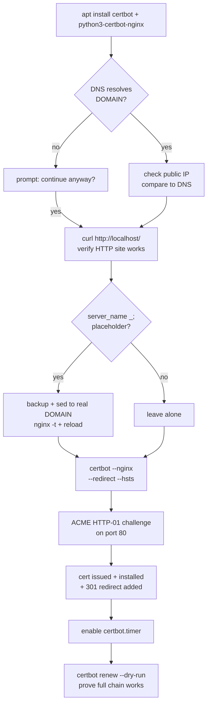
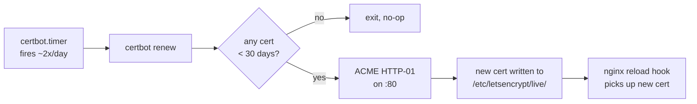

# nginx → WeeWX (HTTPS via Let's Encrypt) — Setup Guide

Turn the HTTP-only WeeWX site into an HTTPS site with a Let's Encrypt
certificate, HTTP→HTTPS redirect, HSTS header, and automatic renewal.

Runs certbot's `--nginx` plugin against an already-working nginx site, so
there's no webroot dance and everything keeps playing nicely with the
tmpfs document root.

---

## What this gives you

| Component                                                         | Purpose                                                             |
|-------------------------------------------------------------------|---------------------------------------------------------------------|
| A Let's Encrypt cert for your domain                              | Stored under `/etc/letsencrypt/live/<domain>/`                      |
| `/etc/nginx/sites-available/default` with TLS + 301 redirect      | certbot edits your existing server block in place                   |
| HSTS header (`Strict-Transport-Security`)                         | 6 months, tells browsers to never use HTTP again                    |
| `certbot.timer` (systemd) enabled                                 | Runs twice a day; only renews when < 30 days remain                 |
| Backup of the pre-SSL site config                                 | Timestamped, saved before `server_name` is rewritten                |

### Setup flow



### Renewal flow (ongoing, automatic)



### Idempotence

The installer `weewx-nginx-ssl.sh` is safe to re-run:

- **certbot install** is skipped if already present
- **DNS / public IP / local nginx** checks run every time; DNS mismatches
  prompt for confirmation, a failing local nginx aborts
- **`server_name` rewrite** only fires if the file still has
  `server_name _;` — if it already has your real domain, left alone
- **`certbot --nginx`** runs with `--keep-until-expiring` — it will
  **not** request a new cert if the existing one has > 30 days left, so
  you won't burn Let's Encrypt rate limit by re-running
- **`certbot.timer`** is enabled idempotently
- **Dry-run renewal** at the end proves the whole chain still works, even
  on a no-op re-run

What the installer does **not** do: automatically detect or switch domain
names. If you want to change the domain, edit the `DOMAIN=…` line at the
top of the installer and re-run; certbot will issue a new cert (and
optionally keep or remove the old one — see uninstall below).

---

## Prerequisites

| Thing                               | Notes                                                                                  |
|-------------------------------------|----------------------------------------------------------------------------------------|
| A public DNS A record (or AAAA)     | `weather.begallie.com` (or whatever's in `DOMAIN=`) must resolve to this Pi's public IP |
| Router port-forward **80 AND 443**  | Both, to this Pi. Port 80 is required not just for issuance but for every renewal       |
| HTTP site working (`weewx-nginx-root.sh`) | `curl http://localhost/` returns 200. Installer aborts if not                     |
| A real email address                | Let's Encrypt uses it for expiry warnings. Already set in the installer (`EMAIL=…`)    |
| Dynamic DNS / static IP             | If your public IP changes, DNS must keep up or renewals will fail at the HTTP-01 step   |
| Pi clock correct                    | TLS / ACME both hate skewed clocks. Should be fine if `systemd-timesyncd` is running    |

**Run order**:

1. `sudo bash install-ramdisk.logging.sh`
2. `sudo bash weewx-database-ramdisk.sh`
3. `sudo bash weewx-site-ramdisk.sh`
4. `sudo bash weewx-nginx-root.sh`
5. **`sudo bash weewx-nginx-ssl.sh`**  ← this script
6. (optional) `sudo bash weewx-onedrive-backup.sh`

---

## How to run

Before running, **edit the top of the script** to match your domain and
email:

```bash
DOMAIN="weather.begallie.com"
EMAIL="dan_begallie@hotmail.com"
```

Then:

```bash
sudo bash weewx-nginx-ssl.sh
```

Expected flow:

1. Installs certbot + the nginx plugin if missing
2. Pre-flight: resolves DNS, compares to detected public IP, tests local nginx
3. Rewrites `server_name _;` → `server_name <DOMAIN>;` (backs up first)
4. Runs `certbot --nginx` to issue the cert and add the 301 redirect + HSTS
5. Ensures `certbot.timer` is enabled
6. Runs `certbot renew --dry-run` to prove renewal works end-to-end
7. Prints verification commands

**Total runtime**: ~30–60 s on a good connection.

---

## What it does (detail)

1. **Install certbot**: `apt install -y certbot python3-certbot-nginx` if
   the `certbot` command isn't already on PATH
2. **Pre-flight sanity**:
   - `getent hosts $DOMAIN` to confirm DNS resolves from this machine
   - `curl https://api.ipify.org` to compare against public IP (informational)
   - `curl -sf http://localhost/` to confirm the HTTP site works — aborts if not
3. **Domain rewrite**: if `sites-available/default` still has
   `server_name _;`, backs up the file to `default.bak.<timestamp>` and
   `sed`s in the real domain. certbot's `--nginx` plugin keys off
   `server_name` to find the right block to modify
4. **`nginx -t && systemctl reload nginx`** to pick up the new server_name
5. **Issue + install the cert**:
   ```
   certbot --nginx -d $DOMAIN -m $EMAIL
     --agree-tos --no-eff-email --non-interactive
     --redirect --hsts --keep-until-expiring
   ```
   - `--nginx` plugin handles both ACME challenge (via a temporary server
     block certbot adds + removes) and installation (edits your existing
     server block to add `ssl_certificate`, `listen 443 ssl http2`, etc.)
   - `--redirect` inserts a 301 from HTTP → HTTPS
   - `--hsts` adds `Strict-Transport-Security: max-age=15552000` (6 months)
   - `--keep-until-expiring` prevents unnecessary re-issuance if a valid
     cert with > 30 days is already there
6. **Enable `certbot.timer`** (idempotent) and show its status
7. **`certbot renew --dry-run`** — exercises the full renewal path against
   Let's Encrypt's staging servers. No rate-limit impact

---

## What you can customize

**Edit at the top of the installer** (these are not externalised to a
conf file — changes require a re-run):

| Variable      | Default                     | Notes                                                   |
|---------------|-----------------------------|---------------------------------------------------------|
| `DOMAIN`      | `weather.begallie.com`      | Your public hostname. Must have a DNS record pointing here |
| `EMAIL`       | `dan_begallie@hotmail.com`  | Used for Let's Encrypt expiry notifications             |
| `SITE_AVAIL`  | `/etc/nginx/sites-available/default` | Which server block certbot modifies            |

**After install**, several things are tunable in
`/etc/nginx/sites-available/default` (certbot edited it in place):

| Thing                        | Where                                                  | Notes                                                 |
|------------------------------|--------------------------------------------------------|-------------------------------------------------------|
| HSTS duration                | `add_header Strict-Transport-Security "max-age=…"`     | Default 15552000 (6 mo). Browsers cache this, so *don't* raise then lower |
| Redirect behaviour           | The `if ($host = …)` block + `return 301 https://…;`   | certbot writes this into the `:80` server block       |
| TLS protocol/ciphers         | `include /etc/letsencrypt/options-ssl-nginx.conf;`     | Managed by certbot; edit `options-ssl-nginx.conf` if you need to tighten |
| Asset caching (from root installer) | Unchanged by certbot                            | Still 5m `Cache-Control` on png/css/js                |

**Adding a second domain** (e.g. `weather.begallie.com` **and**
`wx.begallie.com`):

```bash
sudo certbot --nginx -d weather.begallie.com -d wx.begallie.com \
  --expand --redirect --hsts
```

`--expand` attaches the new name to the existing cert without starting
over.

**Renewal hooks** — if you need to run something when a cert renews:

```bash
sudo mkdir -p /etc/letsencrypt/renewal-hooks/post
sudo tee /etc/letsencrypt/renewal-hooks/post/reload-nginx.sh <<'EOF'
#!/bin/sh
systemctl reload nginx
EOF
sudo chmod +x /etc/letsencrypt/renewal-hooks/post/reload-nginx.sh
```

(The nginx plugin already reloads nginx after a successful renewal; this
is only needed if you're also reloading a non-nginx service.)

---

## Differences by Raspberry Pi model / configuration

This is mostly a deployment story, not a hardware story:

| Scenario                                           | Consideration                                                                                      |
|----------------------------------------------------|----------------------------------------------------------------------------------------------------|
| Residential ISP + dynamic public IP                | Use a dynamic-DNS service (DuckDNS, No-IP, Cloudflare API). Let's Encrypt renews every ~60 days — if the IP changes and DNS is stale, renewal fails silently until the cert expires |
| CGNAT / double-NAT (no direct :80 inbound)         | HTTP-01 won't work. Use DNS-01 instead: `certbot --dns-cloudflare` (or your provider's plugin). This installer doesn't cover DNS-01 |
| Cloudflare proxy in front                          | Turn off Cloudflare's orange cloud for the duration of issuance/renewal, OR use DNS-01, OR use an origin cert. HTTP-01 won't pass through the proxy |
| IPv6-only or IPv6-preferred DNS                    | Add an AAAA record. Forward TCP/80 and TCP/443 for v6 too                                          |
| LAN-only / no public IP                            | You can't use Let's Encrypt HTTP-01 at all. Options: DNS-01 with a real domain, or self-signed / local CA (mkcert). This installer is for public-facing sites |
| Pi 3 / Pi Zero                                     | certbot is slow to install (python deps) — budget a few minutes for the initial apt install. After that, no CPU concerns |
| Multiple sites on the same Pi                      | certbot works fine — specify `-d` per site. Keep each site in its own `sites-available/<name>` file |

---

## How to validate success

**Right after install:**

```bash
# 1. Cert is issued and present
sudo certbot certificates
# Expect: a line like "Certificate Name: weather.begallie.com" with "VALID: ~90 days"

# 2. HTTP redirects to HTTPS
curl -sI http://$DOMAIN/ | head -2
# Expect: HTTP/1.1 301 Moved Permanently
#         Location: https://$DOMAIN/

# 3. HTTPS serves the page
curl -sI https://$DOMAIN/ | head -1
# Expect: HTTP/2 200

# 4. HSTS header is set
curl -sI https://$DOMAIN/ | grep -i strict-transport-security
# Expect: strict-transport-security: max-age=15552000; includeSubDomains

# 5. Renewal timer is enabled
systemctl list-timers certbot.timer

# 6. Dry-run renewal passes
sudo certbot renew --dry-run
```

**Browser check**: visit `https://$DOMAIN/` — valid padlock, no mixed-content
warnings. Then `http://$DOMAIN/` — should bounce to HTTPS.

**External validation** (use a machine *off* your network, or an online
tool):

```bash
# From a non-local machine:
curl -sI https://$DOMAIN/ | head -1

# Or online:
#   https://www.ssllabs.com/ssltest/analyze.html?d=weather.begallie.com
#   Aim for A or A+
```

**Ongoing** (monthly, takes 10 seconds):

```bash
sudo certbot certificates           # Days remaining
systemctl status certbot.timer      # Timer still enabled, next run visible
journalctl -u certbot.service --since "30 days ago" --no-pager | tail -20
```

**If a renewal fails**, Let's Encrypt emails the `EMAIL=` address 20 days
before expiry, then again at 7 days. Don't ignore those.

---

## Troubleshooting

| Symptom | Likely cause | Fix |
|---|---|---|
| `certbot` reports "Connection refused" / "timeout" during issuance | Port 80 not forwarded to the Pi, or blocked by firewall | From outside: `curl http://$DOMAIN/` must return 200. Check router port-forward + ISP block (some ISPs block :80) |
| `certbot` reports "DNS problem: NXDOMAIN looking up A for $DOMAIN" | DNS record missing or not yet propagated | `dig $DOMAIN` from an external resolver. Wait for TTL or fix the record |
| `certbot` reports "no valid A records found" but DNS resolves from the Pi | DNS is resolving from a LAN-only zone (pi-hole, AdGuard, router) | Check from a public resolver: `dig @1.1.1.1 $DOMAIN`. Fix the public DNS record |
| Browser shows `ERR_CERT_COMMON_NAME_INVALID` | Cert is for the wrong name, or you're using IP not hostname | Visit via `https://$DOMAIN/`, not the raw IP. If still broken, `certbot certificates` to confirm the cert name |
| `ERR_SSL_PROTOCOL_ERROR` | nginx isn't listening on 443, or 443 not forwarded | `sudo ss -ltnp \| grep :443` should show nginx. Then check router |
| Renewal dry-run fails with "Unable to find a virtual host" | `server_name` got reset to `_;` (manual edit?) | Fix `server_name` in `sites-available/default` to match `DOMAIN`, `nginx -t && reload`, re-run dry run |
| HSTS "stuck" after you've changed plans | Browsers cache HSTS for `max-age` seconds | Clear HSTS in browser (Chrome: `chrome://net-internals/#hsts`), or lower `max-age` and wait |
| Mixed content warnings (page loads but padlock is yellow) | Something inside the WeeWX report HTML links to `http://…` | Check your skin config — most skins let you configure `HTML_ROOT_URL` to use `https://` |
| `certbot.timer` missing | Old or snap-installed certbot | `systemctl list-unit-files 'certbot*'` — if nothing, reinstall via apt: `apt install --reinstall certbot` |
| Too-many-registrations / rate-limit error | You've been re-running `certbot --nginx` without `--keep-until-expiring` | Wait for the rate limit window (usually a week), or use `--dry-run` for testing |
| `certbot renew` runs but cert isn't renewed | < 30 days-until-expiry threshold not met yet — this is normal | `certbot certificates` shows days left. Real renewal happens around day 60 of 90 |
| After renewing, browser still shows old cert / warning | nginx wasn't reloaded | Nginx plugin usually handles this. `sudo systemctl reload nginx`. Clear browser cache |

### Diagnostic bundle

```bash
sudo certbot certificates
sudo nginx -T | grep -E 'listen|server_name|ssl_certificate' | head -30
systemctl status nginx certbot.timer --no-pager | head -30
journalctl -u certbot --since "30 days ago" --no-pager | tail -40
dig $DOMAIN +short
curl -sI http://$DOMAIN/ | head -3
curl -sI https://$DOMAIN/ | head -3
ls -la /etc/letsencrypt/live/$DOMAIN/
sudo ss -ltnp | grep -E ':80|:443'
```

---

## Uninstall / revert

### Option A — remove just the cert (keep HTTP working)

```bash
# 1. Delete the cert + renewal config
sudo certbot delete --cert-name $DOMAIN

# 2. Roll nginx back to the pre-SSL config
ls -lt /etc/nginx/sites-available/default.bak.* | head -1
# Copy the most recent pre-SSL backup (the one from right before this installer ran):
sudo cp /etc/nginx/sites-available/default.bak.<timestamp> \
        /etc/nginx/sites-available/default
sudo nginx -t && sudo systemctl reload nginx

# 3. Verify you're back to HTTP-only
curl -sI http://localhost/ | head -1     # 200
curl -sI https://localhost/ 2>&1 | head  # connection refused (expected)
```

### Option B — remove certbot entirely

```bash
sudo systemctl disable --now certbot.timer
sudo certbot delete --cert-name $DOMAIN
sudo apt remove --purge certbot python3-certbot-nginx
sudo rm -rf /etc/letsencrypt
```

Then do step 2 from Option A to roll back the nginx config.

### Option C — switch domains

```bash
# 1. Stop renewal of the old cert
sudo certbot delete --cert-name $DOMAIN

# 2. Edit the installer — change DOMAIN=
sudo nano weewx-nginx-ssl.sh

# 3. Update the DNS A record for the new domain to point here

# 4. Re-run
sudo bash weewx-nginx-ssl.sh
```

### Option D — temporarily disable HTTPS (debugging)

```bash
# Don't delete anything — just revert the nginx config
sudo cp /etc/nginx/sites-available/default.bak.<pre-ssl-timestamp> \
        /etc/nginx/sites-available/default
sudo nginx -t && sudo systemctl reload nginx

# Cert is still present and still auto-renews; re-enable later by:
sudo bash weewx-nginx-ssl.sh
```

### Clean up accumulated backups

Each re-run of `weewx-nginx-root.sh` or `weewx-nginx-ssl.sh` adds another
`sites-available/default.bak.<timestamp>` file. Tidy:

```bash
ls -t /etc/nginx/sites-available/default.bak.* | tail -n +4 | xargs -r sudo rm --
# Keeps the 3 most recent
```

---

## Related scripts

- `weewx-nginx-root.sh` — prerequisite. Gets nginx serving WeeWX on HTTP
  with the right `root` and `location` blocks certbot's `--nginx` plugin
  expects
- `weewx-site-ramdisk.sh` — creates the tmpfs that nginx serves
- `weewx-database-ramdisk.sh` — separate story; DB on zram with validated snapshots
- `weewx-onedrive-backup.sh` — off-site DB backups; unrelated to nginx

Nothing in this installer assumes a specific Pi model — any model that
runs nginx and can reach Let's Encrypt can use it.