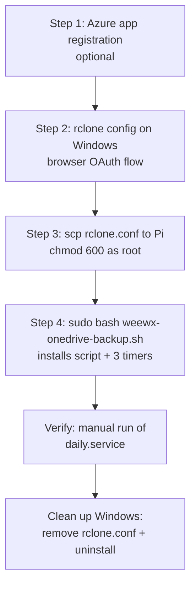
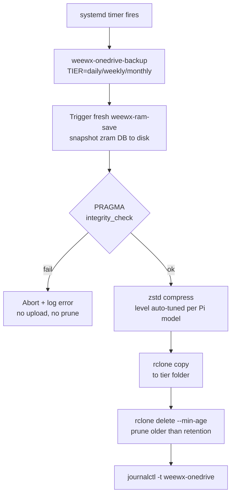

# OneDrive Backup Setup for WeeWX on Raspberry Pi

End-to-end walkthrough for getting rclone talking to your personal OneDrive and
wiring up the daily/weekly/monthly backup timers on the Pi.

**Recommended approach**: do the interactive `rclone config` on your **Windows
machine** (which has a working browser), then copy the resulting `rclone.conf`
over to the Pi. This sidesteps every headless-auth issue people hit with
browser prefetch, Windows Defender scanning localhost URLs, double-submitted
codes, etc.

---

## What this gives you

Three rolling tiers of off-site backups of your WeeWX SQLite database, each
triggered by a systemd timer and uploaded to a separate OneDrive folder. Each
backup is pulled from the zram ramdisk (the live copy WeeWX writes to),
re-validated with `PRAGMA integrity_check`, compressed with zstd, uploaded,
then the tier's folder is pruned to its retention count.

| Tier    | Fires              | Keeps          | OneDrive folder                        |
|---------|--------------------|----------------|----------------------------------------|
| daily   | daily 02:30 (±10m) | last 7 days    | `<REMOTE_ROOT>/daily`                  |
| weekly  | Sun 03:30 (±10m)   | last 8 weeks   | `<REMOTE_ROOT>/weekly`                 |
| monthly | 1st 04:30 (±10m)   | last ~12 months| `<REMOTE_ROOT>/monthly`                |

`REMOTE_ROOT` defaults to `Documents-Private/Backups/WeeWX/Database` and is
defined once at the top of `weewx-onedrive-backup.sh`. The installer writes it
to `/etc/weewx-onedrive-backup.conf`, which the runtime script sources, so
it's a single source of truth — change it in one place, re-run the installer,
done.

The three timers are chained with `After=` so that on the one day a month when
all three fire, they run serially — never in parallel (so zram, CPU, and
OneDrive upload bandwidth are never contended).

### Setup flow (one-time, from Windows)



### Runtime flow (every scheduled backup)



### Idempotence

The installer `weewx-onedrive-backup.sh` is safe to re-run. It overwrites the
installed script at `/usr/local/sbin/weewx-onedrive-backup`, the runtime
config at `/etc/weewx-onedrive-backup.conf`, and the six unit files
(`*.service` + `*.timer` for each tier) in place, then `daemon-reload`s and
re-enables the timers. Re-running picks up any changes you've made to the
installer (new schedule, new compression defaults, new `REMOTE_ROOT`) without
leaving orphan units behind.

It does **not** touch `/root/.config/rclone/rclone.conf`, existing OneDrive
backup files, or WeeWX itself. Re-running the installer will never delete an
already-uploaded backup.

---

## Step 1 — (optional) Register your own Azure app

**Skip this entire section if you're happy using rclone's built-in app
credentials.** You'll just leave `client_id` and `client_secret` blank in
`rclone config` and everything works with zero Azure setup. For a personal
OneDrive with ~250 MB/night, the default is fine.

Only register your own app if you want API calls attributed to your own app
identity. The walkthrough below assumes you're doing it.

### 1a. Create the registration

1. Sign in at **https://portal.azure.com** with the Microsoft account that
   owns the target OneDrive
2. Search for **App registrations** → **+ New registration**
3. Fill in:
   - **Name**: anything descriptive (e.g. `weewx-pi-backup`)
   - **Supported account types**: select **"Accounts in any organizational
     directory and personal Microsoft accounts"**
     *(this is the one that allows hotmail/outlook.com accounts)*
   - **Redirect URI**: leave blank for now — we'll add it in the next step
4. Click **Register**

Copy the **Application (client) ID** from the overview page — you'll paste
this into rclone later.

### 1b. Add a Web redirect URI (NOT "Mobile and desktop")

This is the step that trips everyone up. rclone's confidential-client flow
(which uses a `client_secret`) requires the redirect URI to live under the
**Web** platform, not "Mobile and desktop applications."

1. Left sidebar → **Authentication**
2. **+ Add a platform** → choose **Web**
3. **Redirect URI**: `http://localhost:53682/`  ← include the trailing slash
4. Leave **Logout URL** blank
5. Leave **Implicit grant and hybrid flows** unchecked
6. Click **Configure**
7. Scroll down to **Advanced settings** → set **Allow public client flows** to
   **No**
8. Click **Save**

Your Redirect URI configuration page should now show exactly one row:

| Platform Type | Redirect URI |
|---|---|
| **Web** | http://localhost:53682/ |

### 1c. Verify the manifest

Left sidebar → **Manifest**. Azure now shows one of two manifest formats
depending on when your app was created:

- **Microsoft Graph App Manifest** (rolled out 2024, default for new apps) —
  a slimmer JSON without `signInAudience` visible at the top level.
  `signInAudience` is instead driven by the **Supported account types**
  radio you picked in 1a ("Accounts in any organizational directory and
  personal Microsoft accounts"). If you picked the right option there,
  you're already correct and there's nothing to edit here. You can confirm
  by looking at **Authentication → Supported account types**.
- **Legacy AAD Graph App Manifest** (older apps) — shows these two values
  that must match. Use Ctrl+F to find them:
  ```json
  "signInAudience": "AzureADandPersonalMicrosoftAccount",
  "requestedAccessTokenVersion": 2,
  ```
  If either is wrong, fix it here and click **Save**. If Azure refuses to
  save with a "Property api.requestedAccessTokenVersion is invalid" error,
  change `requestedAccessTokenVersion` to `2` first, save, then change
  `signInAudience` and save again.

### 1d. Add API permissions

1. Left sidebar → **API permissions** → **+ Add a permission**
2. **Microsoft Graph** → **Delegated permissions**
3. Add both of these:
   - `Files.ReadWrite.All`
   - `offline_access`  ← critical, this is what lets rclone silently refresh
     its token for months of unattended backups
4. Click **Add permissions**

You don't need to click "Grant admin consent" for a personal account — you'll
consent yourself during the OAuth flow.

### 1e. Create the client secret

1. Left sidebar → **Certificates & secrets** → **Client secrets** tab
2. **+ New client secret**
3. Description: e.g. `rclone-pi`, Expires: **24 months** (the max)
4. Click **Add**
5. **Copy the Value column immediately.** Paste it into a temporary text file
   so you have a clean copy. Azure only shows the full Value once — if you
   navigate away, you'll have to delete this secret and make a new one.

The Value is ~40 characters with tildes/dots/dashes (e.g. `xDM8Q~yPBfdLom...`).
The **Secret ID** column next to it is a GUID — **not** what rclone wants.

---

## Step 2 — Configure rclone on Windows

Install rclone if you don't have it already:

```powershell
winget install Rclone.Rclone
```

Or grab it from **https://rclone.org/downloads/**.

Then in PowerShell:

```powershell
rclone config
```

Answer the prompts as follows:

| Prompt | Answer |
|---|---|
| `e/n/d/r/c/s/q>` | `n` (new remote) |
| `name>` | `onedrive` |
| `Storage>` | `onedrive` (or the number for OneDrive) |
| `client_id>` | your Application (client) ID — or blank for rclone's default |
| `client_secret>` | your client secret **Value** — or blank for rclone's default |
| `region>` | `1` (Microsoft Cloud Global) |
| `tenant>` | **blank** (press Enter) — personal accounts don't have a tenant |
| `Edit advanced config?` | `n` |
| `Use web browser...?` | **`y`** (Windows has a browser — much more reliable than headless mode) |

Your default browser opens → sign in with your Microsoft account → click
**Accept** when it shows the permissions → the browser lands on a "Success!"
page you can close.

Back in PowerShell:

| Prompt | Answer |
|---|---|
| `config_type>` | `1` (OneDrive Personal or Business) |
| `Select drive>` | whichever row is labeled **"OneDrive (personal)"** — its drive ID is a 16-char hex string like `F182ABB27218A4EC`. Other rows with `b!...` long IDs are internal document libraries — don't pick those |
| `Drive OK?` | `y` |
| `Keep this "onedrive" remote?` | `y` |
| final menu | `q` (quit) |

### Verify on Windows

```powershell
rclone listremotes
# should print: onedrive:

rclone lsd onedrive:
# should list your familiar top-level OneDrive folders (Documents, Pictures, etc.)
```

If `lsd` shows your real folder names rather than strange GUID-named ones,
you picked the right drive.

---

## Step 3 — Copy rclone.conf to the Pi

The working config is now at:

```
C:\Users\begal\AppData\Roaming\rclone\rclone.conf
```

Copy it to the Pi. From PowerShell:

```powershell
scp $env:APPDATA\rclone\rclone.conf dan@RPI3-TRIXIE-WEEWX:/tmp/rclone.conf
```

(Replace hostname/username if different. You can also use WinSCP, a USB stick,
or any other file-transfer method.)

On the Pi:

```bash
sudo mkdir -p /root/.config/rclone
sudo mv /tmp/rclone.conf /root/.config/rclone/rclone.conf
sudo chown root:root /root/.config/rclone/rclone.conf
sudo chmod 600      /root/.config/rclone/rclone.conf

# Smoke test as root — this is the context the backup timers will run in
sudo rclone listremotes
sudo rclone lsd onedrive:
```

If `sudo rclone lsd onedrive:` lists your OneDrive folders on the Pi, the
OAuth setup is complete and portable.

---

## Step 4 — Install the backup timers

```bash
sudo bash weewx-onedrive-backup.sh
```

It detects your configured remote, installs the backup script to
`/usr/local/sbin/weewx-onedrive-backup`, writes runtime config to
`/etc/weewx-onedrive-backup.conf`, and wires up three systemd timer+service
pairs:

| Timer                                  | OnCalendar           | Jitter  | Chained after       |
|----------------------------------------|----------------------|---------|---------------------|
| `weewx-onedrive-backup-daily.timer`    | daily 02:30          | ±10 min | —                   |
| `weewx-onedrive-backup-weekly.timer`   | Sun 03:30            | ±10 min | daily.service       |
| `weewx-onedrive-backup-monthly.timer`  | 1st of month 04:30   | ±10 min | weekly.service      |

Each run: triggers a fresh `weewx-ram-save`, re-validates the snapshot with
`PRAGMA integrity_check`, compresses with zstd (level auto-tuned for your
Pi — see table below), uploads to the tier-specific OneDrive folder, prunes
old files in that tier.

### What you can customize

Most knobs live at the top of `weewx-onedrive-backup.sh`. After editing, just
re-run `sudo bash weewx-onedrive-backup.sh` to push the changes through.

| Thing                          | Where                                                | Notes                                            |
|--------------------------------|------------------------------------------------------|--------------------------------------------------|
| Retention per tier             | `KEEP_AGE` in the runtime script's tier `case`       | `7d` / `56d` / `400d` — re-run installer to apply |
| Schedule (`OnCalendar`)        | timer unit heredocs in installer                     | re-run installer; `After=` chains stay in place  |
| Jitter (`RandomizedDelaySec`)  | timer unit heredocs                                  | keeps run start times from clustering exactly    |
| `REMOTE_ROOT` (OneDrive path)  | installer top — default `Documents-Private/Backups/WeeWX/Database` | propagates via `/etc/weewx-onedrive-backup.conf` |
| `ZSTD_LEVEL` override          | env var on the service; otherwise auto-tuned         | 1 (fastest) … 22 (slowest/smallest)              |
| `ZSTD_THREADS` override        | env var on the service; otherwise `nproc`           | useful if you want to leave a core free          |
| Remote name (`onedrive:`)      | installer top — `REMOTE_NAME` variable               | rename your rclone remote and re-run installer   |

To set an override after install without re-running the installer:

```bash
sudo systemctl edit weewx-onedrive-backup-daily.service
# add under [Service]:
# Environment=ZSTD_LEVEL=15
# Environment=ZSTD_THREADS=2
sudo systemctl daemon-reload
```

### Differences by Raspberry Pi model

The installed backup script auto-detects the Pi model from
`/proc/device-tree/model` and picks a zstd compression level that balances
compression ratio against the time the save takes. Bigger Pi = higher level.

| Pi model     | Auto `ZSTD_LEVEL` | Threads (`-T`) | ~Time for 260 MB DB | Notes                                      |
|--------------|-------------------|----------------|---------------------|--------------------------------------------|
| Pi 5         | 19                | 4              | ~1–2 min            | Strong compression, headroom to spare      |
| Pi 4         | 15                | 4              | ~2–3 min            |                                            |
| Pi 3         | 9                 | 4              | ~30–60 s            | Default on this host; level 19 took ~15 min|
| Pi Zero 2 W  | 6                 | 4              | ~1–2 min            |                                            |
| Pi 2         | 6                 | 4              | ~2–4 min            |                                            |
| Pi Zero (v1) | 3                 | 1              | ~3–6 min            | Single-core, very limited RAM              |
| Unknown      | 19                | `nproc`        | —                   | Falls back to max                          |

Override per-host via `systemctl edit` (see above) if the auto pick is wrong
for your workload — e.g. if a Pi 3 is otherwise idle and you'd rather trade a
few extra minutes of CPU for smaller uploads, bump `ZSTD_LEVEL` to 15.

### Verify end-to-end

Kick off a real backup run without waiting for the timer:

```bash
sudo systemctl start weewx-onedrive-backup-daily.service
journalctl -t weewx-onedrive -n 30 --no-pager
```

You should see: triggering save → integrity ok → `Compressing with zstd -9 -T4
(detected: Raspberry Pi 3...)` → upload complete → prune complete. Confirm it
landed:

```bash
sudo rclone --config /root/.config/rclone/rclone.conf \
  lsl onedrive:Documents-Private/Backups/WeeWX/Database/daily
```

A file like `weewx-2026-04-19.sdb.zst` should be there with a size in the
tens of MB (the 259 MB DB compresses heavily with zstd).

### See when the next runs are scheduled

```bash
systemctl list-timers 'weewx-onedrive-backup-*.timer'
```

### How to validate success

A one-time install smoke test:

1. `sudo rclone lsd onedrive:` as root — confirms OAuth works in root's context
2. `sudo systemctl start weewx-onedrive-backup-daily.service` — manual run
3. `journalctl -t weewx-onedrive -n 50 --no-pager` — all INFO, no ERROR
4. `rclone lsl onedrive:Documents-Private/Backups/WeeWX/Database/daily` — new `weewx-YYYY-MM-DD.sdb.zst`
5. `systemctl list-timers 'weewx-onedrive-backup-*.timer'` — three timers enabled, next fires look sane

Ongoing (every couple of weeks, takes ~2 minutes):

```bash
# 1. Are the timers still enabled and firing on time?
systemctl list-timers 'weewx-onedrive-backup-*.timer'

# 2. Have all three tiers written a recent-enough file?
for tier in daily weekly monthly; do
  echo "=== $tier ==="
  sudo rclone --config /root/.config/rclone/rclone.conf \
    lsl onedrive:Documents-Private/Backups/WeeWX/Database/$tier | tail -5
done

# 3. Any failures in the log?
journalctl -t weewx-onedrive --since "30 days ago" | grep -i -E 'error|fail' || echo "clean"
```

And once a year (or before you do anything risky), do a full **restore test**
on a scratch path to prove the backups are actually readable:

```bash
TEST=/tmp/weewx-restore-test
mkdir -p "$TEST"

# Pull the newest daily
LATEST=$(sudo rclone --config /root/.config/rclone/rclone.conf \
  lsf onedrive:Documents-Private/Backups/WeeWX/Database/daily --files-only | sort | tail -1)
sudo rclone --config /root/.config/rclone/rclone.conf \
  copy "onedrive:Documents-Private/Backups/WeeWX/Database/daily/$LATEST" "$TEST/"

zstd -d "$TEST/$LATEST" -o "$TEST/weewx.sdb"
sqlite3 "$TEST/weewx.sdb" 'PRAGMA integrity_check;'
# expected: "ok"

sqlite3 "$TEST/weewx.sdb" \
  'SELECT datetime(MAX(dateTime), "unixepoch", "localtime") FROM archive;'
# expected: a recent timestamp (matching the day of the backup)

rm -rf "$TEST"
```

---

## Troubleshooting — Azure / rclone setup

| Symptom | Likely cause | Fix |
|---|---|---|
| `AADSTS7000215: Invalid client secret` | You pasted the Secret ID (GUID) instead of the Value | Make a new secret in Azure, copy the Value column before navigating away |
| `AADSTS70000: code has expired` (when code is seconds old) | Redirect URI is under "Mobile and desktop" instead of "Web" | Delete that platform in Azure → Authentication, re-add as Web |
| `AADSTS500113: No reply address is registered` | Redirect URI missing or has a typo | Confirm `http://localhost:53682/` is under the Web platform — exact match including trailing slash |
| `account is not part of tenant` | Tenant ID set in rclone config with a personal account | Edit the remote, clear the `tenant` field |
| Windows `rclone authorize` fails but browser shows "Success!" | Defender / AV / browser extension fetched the localhost URL first and consumed the code | Switch to doing `rclone config` directly on Windows (this guide) |
| Token leaked in a screenshot or paste | Refresh tokens last up to 90 days | Delete old secret in Azure, create new one, re-run `rclone config` on Windows, re-copy to Pi. Also remove app consent at https://account.microsoft.com/privacy/app-access |
| Installer fails with `cannot execute: required file not found` | Script has Windows CRLF line endings after transfer | `sed -i 's/\r$//' weewx-onedrive-backup.sh` (or `dos2unix ...`) and re-run |

## Troubleshooting — backups at runtime

| Symptom | Likely cause | Fix |
|---|---|---|
| `failed to get oauth token: invalid_grant` after months of silence | Refresh token expired (inactivity > 90 days, or consent revoked) | On the Pi: `sudo rclone config reconnect onedrive:` — browser flow via Pi's console, OR re-do Step 2 on Windows and re-copy `rclone.conf` |
| Sudden auth failures on the exact day Azure emailed about expiry | 24-month client secret expired | Create a new secret in Azure (Step 1e), edit `/root/.config/rclone/rclone.conf` → update `client_secret = ...`, test with `sudo rclone lsd onedrive:` |
| Log shows "Triggering fresh weewx-ram-save" then appears to hang | Just slow `zstd` on older Pi — not actually hung | Check with `ps -C zstd -o pid,%cpu,cmd` — if CPU > 90%, it's working. If truly stuck, confirm auto-tune picked a sane level: `journalctl -t weewx-onedrive -g Compressing` |
| `integrity_check` failure aborts the backup | Real DB corruption in the zram copy (very rare) | Check `dmesg` for SD card errors. Restore from the most recent good tier (see Restoration). Don't just retry — the save will keep re-copying the same corrupt bytes |
| Monthly run collides with daily/weekly | Shouldn't happen: they're chained with `After=` | Verify: `systemctl cat weewx-onedrive-backup-weekly.service \| grep After` should reference `...daily.service` |
| `onedrive:` remote not found when installer runs | No rclone remote configured yet, or rclone.conf not under `/root/.config/rclone/` | Re-do Step 3. The installer reads `sudo rclone listremotes` |
| Upload hangs on weak network | rclone's default retries | Expected; look at the next journal run. If it persists, add `--timeout 5m --retries 3` to the rclone invocation inside `/usr/local/sbin/weewx-onedrive-backup` |
| zram snapshot path missing / `weewx-ram-save` not triggerable | Ramdisk installer (`weewx-database-ramdisk.sh`) wasn't run, or it was uninstalled | This backup script depends on the zram/tmpfs setup; install that first |
| Backup uploaded under the wrong OneDrive path after editing the installer | `/etc/weewx-onedrive-backup.conf` wasn't refreshed | Re-run `sudo bash weewx-onedrive-backup.sh` — that's what regenerates the config file |

### Collect a diagnostic bundle when something is off

```bash
sudo systemctl status weewx-onedrive-backup-daily.service \
  weewx-onedrive-backup-weekly.service weewx-onedrive-backup-monthly.service \
  --no-pager

journalctl -t weewx-onedrive --since "7 days ago" --no-pager | tail -200

sudo rclone --config /root/.config/rclone/rclone.conf about onedrive:
df -h /var/lib/weewx /tmp
free -m
cat /proc/device-tree/model ; echo
cat /etc/weewx-onedrive-backup.conf
```

---

## Clean up Windows after setup

Once `sudo rclone lsd onedrive:` works on the Pi and a test backup has
landed in OneDrive, you no longer need rclone on the Windows box at all —
the Pi runs its own scheduled backups independently.

The Windows config file (`%APPDATA%\rclone\rclone.conf`) also contains
your **client secret and refresh token in plain text**, so it's worth
removing after you're done even if you'd otherwise keep rclone around.

### 1. Delete the rclone config and token cache

In PowerShell:

```powershell
# Show what's in the rclone app-data folder first (sanity check)
Get-ChildItem $env:APPDATA\rclone -Recurse -Force

# Remove the whole folder (config + any token caches)
Remove-Item -Recurse -Force $env:APPDATA\rclone
```

If you saved a working copy of `rclone.conf` anywhere else during setup
(Downloads, Desktop, a USB stick), delete those too — it's a credential
file, not just config:

```powershell
Get-ChildItem $env:USERPROFILE -Recurse -Filter rclone.conf -ErrorAction SilentlyContinue
```

### 2. Uninstall rclone itself

```powershell
winget uninstall Rclone.Rclone
```

If you installed from the rclone.org zip instead of winget, just delete
the folder you extracted it to and remove it from your PATH if you added
it there.

Verify it's gone:

```powershell
Get-Command rclone -ErrorAction SilentlyContinue
# Should print nothing.
```

### 3. (Optional) Revoke the app from your Microsoft account

Even with the Windows config file deleted, the refresh token the Pi uses
is still tied to the "consent" you granted during the OAuth flow. That's
fine — you want the Pi to keep working. But if you ever want to fully
break the link (e.g. before selling the Pi, or if a token leaks), revoke
consent here:

> https://account.microsoft.com/privacy/app-access

Find your app (e.g. `weewx-pi-backup`) and click **Don't allow**. The Pi
will start failing uploads immediately; you'd re-run `rclone config` on
the Pi to reconnect.

### 4. (Optional) Keep the Azure app registration for the Pi

The Azure app registration itself (App registrations → your app) is what
holds your `client_id`, `client_secret`, and API permissions. The Pi's
`rclone.conf` references these by value, so:

- **Do NOT delete the app registration** unless you want to also
  rebuild rclone on the Pi. Deleting it would invalidate the Pi's
  tokens.
- The client secret you created has a 24-month expiry. Set a calendar
  reminder ~3 weeks before then (Azure sends emails too) so you can
  create a new secret, update the Pi's `rclone.conf` line
  `client_secret = ...`, and avoid a silent backup failure.
- If you didn't register your own Azure app (left `client_id` /
  `client_secret` blank during `rclone config`), this section is N/A —
  there's nothing in Azure to manage.

---

## Uninstall / revert on the Pi

The installer makes a bounded, easy-to-undo set of changes. To fully back
out:

```bash
# 1. Stop and disable the three timers (and the services, in case one is running)
for tier in daily weekly monthly; do
  sudo systemctl disable --now weewx-onedrive-backup-${tier}.timer
  sudo systemctl stop          weewx-onedrive-backup-${tier}.service 2>/dev/null || true
done

# 2. Remove the unit files
sudo rm -f /etc/systemd/system/weewx-onedrive-backup-{daily,weekly,monthly}.{service,timer}
sudo systemctl daemon-reload
sudo systemctl reset-failed 'weewx-onedrive-backup-*'

# 3. Remove the installed backup script and runtime config
sudo rm -f /usr/local/sbin/weewx-onedrive-backup
sudo rm -f /etc/weewx-onedrive-backup.conf

# 4. (Optional) Remove the rclone config — only do this if you're also done
#    with OneDrive backups entirely. This will break any manual 'sudo rclone'
#    commands going forward.
sudo rm -rf /root/.config/rclone

# 5. Verify nothing is left
systemctl list-unit-files 'weewx-onedrive-backup-*'   # should be empty
ls -l /usr/local/sbin/weewx-onedrive-backup 2>&1      # should be 'No such file'
ls -l /etc/weewx-onedrive-backup.conf 2>&1            # should be 'No such file'
```

Existing backups already in OneDrive are untouched. If you want to delete
those too (e.g. decommissioning):

```bash
# DESTRUCTIVE — deletes all backup files in the three tier folders
sudo rclone --config /root/.config/rclone/rclone.conf \
  purge onedrive:Documents-Private/Backups/WeeWX/Database
```

If you're only partially reverting (e.g. going back to a different schedule
or compression level), just edit `weewx-onedrive-backup.sh` and re-run it —
the installer is idempotent and overwrites the prior config.

---

## Restoration

See separate walkthrough. Short version: `rclone copy` a `.sdb.zst` from
`onedrive:Documents-Private/Backups/WeeWX/Database/<tier>` to `/tmp`,
decompress with `zstd -d`, validate with `sqlite3 ... 'PRAGMA integrity_check;'`,
then stop weewx + weewx-ramdisk, drop the file at
`/var/lib/weewx.hdd/weewx.sdb` with `chown weewx:weewx`, start weewx-ramdisk +
weewx.