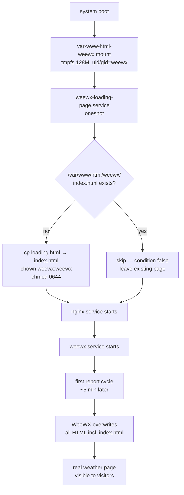
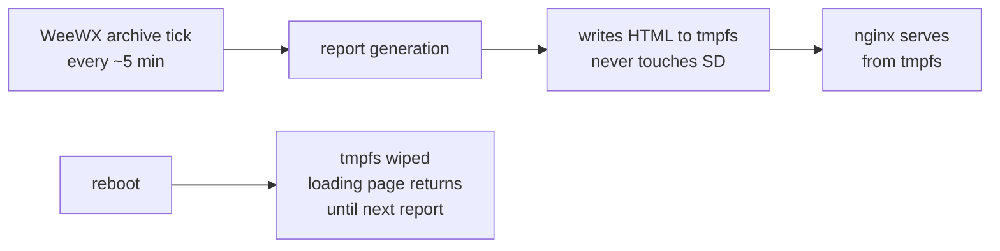

# WeeWX Website on tmpfs + Loading Page — Setup Guide

Serve the WeeWX-generated HTML reports from a **tmpfs** (a RAM-backed
filesystem) instead of the SD card, and drop a static "Station Loading…"
page in place between boot and the first WeeWX report cycle.

**Why**: WeeWX rewrites every HTML file in its report directory every
archive interval (typically every 5 minutes). Over years on a single SD
card, that's a huge amount of rewrite churn for data that doesn't need to
survive a reboot — WeeWX will regenerate all of it on the next cycle. Move
the whole directory to tmpfs and the SD card never sees those writes at
all. The loading page fills the ~5 minute gap between boot and the first
report cycle so visitors don't see a bare 403/404.

---

## What this gives you

| Component                                     | Purpose                                                     |
|-----------------------------------------------|-------------------------------------------------------------|
| `/var/www/html/weewx` (tmpfs, 128M)           | Where WeeWX publishes HTML — served by nginx                |
| `/usr/local/share/weewx-ramdisk/loading.html` | Master copy of the loading page (edit here to change it)    |
| `/etc/fstab` tmpfs entry                      | Makes the tmpfs mount survive reboots                       |
| `weewx-loading-page.service`                  | Boot-time oneshot: copies master → `index.html` iff empty   |
| `var-www-html-weewx.mount` (auto-generated)   | systemd's mount unit synthesised from the fstab line        |

The clever bit is `ConditionPathExists=!/var/www/html/weewx/index.html`
on the loading-page service. On boot the tmpfs is empty, the condition is
true, and the loading page gets dropped in. Once WeeWX finishes its first
report cycle and writes a real `index.html`, the loading page is naturally
overwritten — and next boot the cycle repeats without manual intervention.

### Boot flow



### Runtime behaviour



### Idempotence

The installer `weewx-site-ramdisk.sh` is safe to re-run. It:

- **fstab**: appends the tmpfs line only if a matching entry isn't already
  there (grep check). Backs up `/etc/fstab` to
  `/etc/fstab.bak.<timestamp>` the first time it touches it
- **Master loading.html**: always overwritten with the embedded copy. If
  you've customized the page, your edits are lost on re-run — save your
  custom version elsewhere first if you plan to re-run the installer
- **Systemd unit**: always overwritten
- **Mount**: if already mounted, left alone; if not, `mount` runs
- **Tmpfs content**: only drops the loading page in if `index.html` is
  missing. An existing WeeWX-generated page is never clobbered by re-running

---

## Prerequisites

| Thing                            | Notes                                                  |
|----------------------------------|--------------------------------------------------------|
| Raspberry Pi OS (any recent)     | Tested on Bullseye / Bookworm / Trixie                 |
| nginx (or another web server)    | Must be configured to serve from `/var/www/html/weewx` — see the `weewx-nginx-root.sh` / `weewx-nginx-ssl.sh` installers |
| WeeWX installed                  | Must be configured to write reports to `/var/www/html/weewx` (the default varies by distro; check `weewx.conf` `[StdReport]` → `HTML_ROOT`) |
| 128 MB free RAM                  | Tmpfs is capped at 128M but only uses what's actually written |

**Run order** (first-time install):

1. `sudo bash install-ramdisk.logging.sh`
2. `sudo bash weewx-database-ramdisk.sh`
3. **`sudo bash weewx-site-ramdisk.sh`**  ← this script
4. `sudo bash weewx-nginx-root.sh` (or `weewx-nginx-ssl.sh`)
5. `sudo bash weewx-onedrive-backup.sh` (optional)

You can do step 3 before or after nginx — the tmpfs mount and the loading
page don't depend on nginx, and nginx's config already expects the
directory to exist.

---

## How to run

```bash
sudo bash weewx-site-ramdisk.sh
```

The script:

1. Creates `/usr/local/share/weewx-ramdisk/` and `/var/www/html/weewx/`
2. Appends the tmpfs line to `/etc/fstab` (first run only) and mounts it
3. Writes `loading.html` to the share dir
4. Installs `weewx-loading-page.service` and enables it
5. If the tmpfs is empty right now, drops the loading page in immediately
   so you can see it without waiting for a reboot

Running it for the first time is safe even while WeeWX is generating
reports — it won't overwrite an existing `index.html`.

---

## What it does (detail)

1. **fstab**: appends (if not present)
   ```
   tmpfs  /var/www/html/weewx  tmpfs  noatime,nosuid,size=128M,uid=weewx,gid=weewx,mode=0755  0  0
   ```
   `uid=weewx,gid=weewx,mode=0755` means WeeWX can write to the tmpfs root
   directly without any extra chown step after each remount
2. **`systemctl daemon-reload`**: so systemd re-parses fstab and generates
   `var-www-html-weewx.mount` automatically
3. **`mount /var/www/html/weewx`**: only if it isn't already a mountpoint
4. **Writes the loading page master** to
   `/usr/local/share/weewx-ramdisk/loading.html` (a standalone HTML file
   with inline CSS, `<meta http-equiv="refresh" content="60">` to auto-refresh
   every minute so visitors eventually see the real page without reloading)
5. **Installs the systemd unit** `/etc/systemd/system/weewx-loading-page.service`:
   - `DefaultDependencies=no` + `After=var-www-html-weewx.mount local-fs.target`
     so the tmpfs is definitely mounted when we run
   - `Before=nginx.service weewx.service` so nginx doesn't serve an empty
     dir if it happens to start before this unit
   - `ConditionPathExists=!/var/www/html/weewx/index.html` — the magic that
     keeps the service from clobbering real WeeWX output
   - `Type=oneshot`, `RemainAfterExit=yes` — runs once per boot and stays "active"
6. **Enables the service** (via `systemctl enable`)
7. **Places the loading page immediately** if the tmpfs is empty right now

---

## What you can customize

### The loading page itself

Edit the master copy:

```bash
sudo nano /usr/local/share/weewx-ramdisk/loading.html
```

To see your change without waiting for a reboot (and without waiting for
WeeWX to regenerate):

```bash
# Blow away whatever's on the tmpfs and let the service re-copy
sudo rm /var/www/html/weewx/index.html
sudo systemctl start weewx-loading-page.service
curl -I http://localhost/           # should return 200
```

On the next reboot, your edited loading.html is what appears until WeeWX
catches up.

**Caveat**: re-running `weewx-site-ramdisk.sh` overwrites the master. If
you've customized it heavily, keep a backup of your edited `loading.html`
outside `/usr/local/share/weewx-ramdisk/`.

### Other knobs

| Thing                    | Where                                        | Notes                                                 |
|--------------------------|----------------------------------------------|-------------------------------------------------------|
| Tmpfs size               | `TMPFS_SIZE=128M` at top of installer        | Edit and re-run, then `mount -o remount /var/www/html/weewx` or reboot |
| Mount path               | `WEEWX_WEB_DIR=/var/www/html/weewx`          | Must match WeeWX's `HTML_ROOT` in `weewx.conf` and nginx's `root` directive |
| File owner               | `WEB_OWNER=weewx`, `WEB_GROUP=weewx`         | Must be the user WeeWX runs as                        |
| fstab mount options      | inside `FSTAB_LINE=…`                        | `noatime,nosuid` already minimizes overhead — usually no change needed |
| Auto-refresh interval    | `<meta http-equiv="refresh" content="60">` in loading.html | Change to any value in seconds                         |

---

## Differences by Raspberry Pi model / configuration

This installer is largely model-agnostic — tmpfs is cheap on every Pi — but
there are a few considerations:

| Pi model / config            | Consideration                                                                        |
|------------------------------|--------------------------------------------------------------------------------------|
| Pi 3, Pi Zero, Pi 2          | 128 MB tmpfs is fine. WeeWX's generated HTML for a typical station is 10–30 MB      |
| Pi 5 / Pi 4 (heavy skins)    | If you run multiple WeeWX report skins (Belchertown + Seasons + custom), you may need 256M — `TMPFS_SIZE=256M` |
| Heavy static assets in skin  | If your skin bundles large PNG/favicons/fonts, watch `df -h /var/www/html/weewx`. Bump `TMPFS_SIZE` accordingly |
| Non-weewx user               | If WeeWX runs as a different user, change `WEB_OWNER`/`WEB_GROUP` **and** the fstab `uid=/gid=` options together |
| No WeeWX report skin enabled | Loading page will persist indefinitely — that's fine, it'll just never get overwritten. You should probably disable the loading-page service in that case |
| Different web server (Apache / Caddy) | Works unchanged — nothing here is nginx-specific. The `Before=nginx.service` line in the unit is a no-op if nginx isn't installed |

---

## How to validate success

**Right after install:**

```bash
# 1. tmpfs is actually mounted with the right options
mount | grep weewx
# Expect: tmpfs on /var/www/html/weewx type tmpfs (rw,nosuid,noatime,size=...,uid=<weewxuid>,gid=<weewxgid>,mode=755)

# 2. fstab entry is in place
grep weewx /etc/fstab

# 3. Master loading page exists
ls -l /usr/local/share/weewx-ramdisk/loading.html

# 4. Loading page is on the tmpfs right now (if WeeWX hasn't written yet)
ls -l /var/www/html/weewx/index.html
head -5 /var/www/html/weewx/index.html

# 5. Unit is enabled
systemctl is-enabled weewx-loading-page.service
systemctl status weewx-loading-page.service --no-pager

# 6. Local HTTP check (if nginx is up)
curl -sI http://localhost/ | head -5
```

**Simulate a reboot scenario** without actually rebooting:

```bash
# Clear the tmpfs (safe — WeeWX will just regenerate on next report cycle)
sudo rm -f /var/www/html/weewx/index.html

# Service condition should now pass; start it manually
sudo systemctl start weewx-loading-page.service
ls -l /var/www/html/weewx/index.html
# should exist again, owned by weewx:weewx, containing the loading page markup
```

**Confirm WeeWX overwrites the loading page** after its first report cycle:

```bash
# After WeeWX has had at least one archive interval (default 5 min), check:
grep -q "Station Loading" /var/www/html/weewx/index.html && echo "still loading page" || echo "WeeWX output"

# You can also force a report generation:
sudo systemctl stop weewx
sudo -u weewx weewxd --log-label test-run &
# wait ~30s, then stop and restart the normal service
```

**Periodically** (monthly-ish):

```bash
# Is the tmpfs approaching full?
df -h /var/www/html/weewx

# Any unit failures?
systemctl status weewx-loading-page.service --no-pager | head
journalctl -u weewx-loading-page.service -n 20 --no-pager
```

---

## Troubleshooting

| Symptom | Likely cause | Fix |
|---|---|---|
| Browser shows default nginx "Welcome" page at `/` | nginx isn't pointed at `/var/www/html/weewx` | Run `weewx-nginx-root.sh` or configure nginx's `root` directive manually |
| 403 Forbidden from nginx after reboot | tmpfs mounted but empty, loading-page service didn't run | `systemctl status weewx-loading-page.service`; check the condition (`ConditionPathExists=!…`) isn't falsely triggering. Usually: the master file `/usr/local/share/weewx-ramdisk/loading.html` was deleted |
| 403/404 that persists after several minutes | WeeWX isn't generating reports | Separate WeeWX issue — check `systemctl status weewx` and `journalctl -u weewx` |
| Loading page never gets overwritten by WeeWX | `HTML_ROOT` in `weewx.conf` doesn't match `WEEWX_WEB_DIR` | `grep HTML_ROOT /etc/weewx/weewx.conf` — must be `/var/www/html/weewx` |
| Permission denied writing to tmpfs | fstab `uid=/gid=` doesn't match `WEB_OWNER/WEB_GROUP` | Re-run the installer, or manually `sudo mount -o remount,uid=weewx,gid=weewx /var/www/html/weewx` and update `/etc/fstab` |
| `df` shows tmpfs full at 128M | Some skin is writing enormous assets | Bump `TMPFS_SIZE`, re-run installer, then `sudo mount -o remount,size=256M /var/www/html/weewx` (or reboot) |
| Changes to loading.html don't appear | Cached by browser, or `index.html` already present | Hard-refresh, or `sudo rm /var/www/html/weewx/index.html && sudo systemctl start weewx-loading-page.service` |
| `weewx-loading-page.service` shows "condition failed" after reboot | WeeWX wrote its `index.html` before our unit ran — not actually a problem | This is cosmetically surprising but harmless. The real page is already there |
| After unmount + remount, loading page is gone | tmpfs is wiped on unmount, and the service has `RemainAfterExit=yes` — already "active" so won't re-run | `sudo systemctl restart weewx-loading-page.service` or just reboot |

### Diagnostic bundle

```bash
mount | grep weewx
df -h /var/www/html/weewx
grep weewx /etc/fstab
ls -la /var/www/html/weewx/ /usr/local/share/weewx-ramdisk/
systemctl status weewx-loading-page.service weewx.service nginx.service --no-pager
journalctl -u weewx-loading-page.service -b --no-pager
grep -E 'HTML_ROOT|HTML_ROOT' /etc/weewx/weewx.conf || true
```

---

## Uninstall / revert

```bash
# 1. Stop anything that depends on the tmpfs content
sudo systemctl stop nginx weewx 2>/dev/null || true

# 2. Disable and remove the loading-page service
sudo systemctl disable --now weewx-loading-page.service
sudo rm -f /etc/systemd/system/weewx-loading-page.service
sudo systemctl daemon-reload

# 3. Unmount the tmpfs
sudo umount /var/www/html/weewx || sudo umount -l /var/www/html/weewx

# 4. Remove the fstab line
sudo cp /etc/fstab /etc/fstab.bak.$(date +%Y%m%d-%H%M%S)
sudo sed -i '\|tmpfs\s\+/var/www/html/weewx\s\+tmpfs|d' /etc/fstab
sudo systemctl daemon-reload

# 5. (Optional) Remove the loading page master
sudo rm -rf /usr/local/share/weewx-ramdisk

# 6. If you want WeeWX to go back to writing HTML to SD card, the directory
#    /var/www/html/weewx is now a plain empty SD-backed directory — make
#    sure WeeWX has write permission to it:
sudo mkdir -p /var/www/html/weewx
sudo chown -R weewx:weewx /var/www/html/weewx
sudo chmod 0755 /var/www/html/weewx

# 7. Restart services
sudo systemctl start weewx nginx

# 8. Verify the mount is gone
mount | grep weewx          # should be empty
grep weewx /etc/fstab       # should show no tmpfs line for /var/www/html/weewx
```

**Keep the tmpfs, drop just the loading page** (if you've decided you'd
rather serve an empty dir until WeeWX writes something):

```bash
sudo systemctl disable --now weewx-loading-page.service
sudo rm -f /etc/systemd/system/weewx-loading-page.service \
           /usr/local/share/weewx-ramdisk/loading.html
sudo rm -f /var/www/html/weewx/index.html
sudo systemctl daemon-reload
```

**Re-run to pick up changes**:

```bash
# Totally safe — idempotent, preserves existing index.html
sudo bash weewx-site-ramdisk.sh
```

---

## Related scripts

- `install-ramdisk.logging.sh` — zram swap + log2ram (sibling, runs first)
- `weewx-database-ramdisk.sh` — puts the WeeWX SQLite DB on zram with
  validated hourly snapshots
- `weewx-nginx-root.sh` / `weewx-nginx-ssl.sh` — configure nginx to serve
  from `/var/www/html/weewx` (HTTP or HTTPS respectively)
- `weewx-onedrive-backup.sh` — off-site backup of the DB (not the HTML —
  HTML is always regeneratable from the DB)